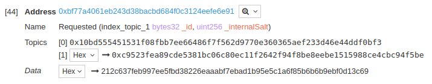

The entry point for requesting loans is the LoanManager; this contract handles the verification of the intent of the borrower/creator/cosigner. So all requests are performed calling this contract.

Loans can be requested by the borrower (self-signed) or using a creator, after the creation of the request, once approved, the request is available to be filled by a lender.

## Create a request

The requester can choose any conditions for the loan; bad conditions probably result in the request never being filled, to avoid this is recommended to set request parameters in line with the lenders market.

### Amount & Oracle

The Oracle defines what is going to be the currency of the loan, how many decimals that currency has, and how much is the equivalency of that currency to RCN; so the chosen Oracle will define the value of the requested amount.

~~~ javascript
// Oracle
// Currency: ARS
// Decimals: 2
const oracle = 0x22222c1944EfCC38CA46489f96c3A372C4dB74E6
// Requested amount, 100 ARS
const amount = 10000;
~~~

If the Oracle is set to 0x0, the currency is assumed to be RCN and the decimals of RCN are 18.

~~~ javascript
// No Oracle
// Currency: RCN
// Decimals: 18
const oracle = 0x0;
// Requested amount, 10 RCN
const amount = 10000000000000000000;
~~~

### Borrower

The borrower is the Ethereum address that is going to receive the tokens of the lending, this field can be set to any address, but if the borrower is not the requester, the loan is considered not-approved and must be approved before filled. See [Approbation](#Approbation).

### Salt

The loan request process also adds a salt parameter, because it's forbidden to request two loans with the same ID, the salt allows a requester to request many identical loans.

This salt, like all the parameters of the request, is used to generate the ID hash of the petition.

### Expiration

Expiration is an absolute Unix-timestamp on which a non-filled request will no longer be valid; we recommend setting this parameter with a max value of 1 or 2 months from now.

### Model

The model is the brain of the loan, defines the repayments and interest scheme.

Each model defines its constructor, parameters, internal logic or even extensions, for this example, we are going to be using the InstallmentsModel reference model, but the process is similar for any model.

### Loan data

The loan data is an arbitrary length bytes parameter, acting as the creation data for the registry inside the [Model](#Model)

The model should provide a helper function to construct this loan data; here we are using the reference InstallmentsModel *encodeData* method.

~~~ solidity
    function encodeData(
        uint128 _cuota,
        uint256 _interestRate,
        uint24 _installments,
        uint40 _duration,
        uint32 _timeUnit
    ) external pure returns (bytes) {
        return abi.encodePacked(
            _cuota,
            _interestRate,
            _installments,
            _duration,
            _timeUnit
        );
    }
~~~
> Note: In this case the encoded data is just packed using abi.encodePacked, this is a common pattern but is not part of the protocol

#### Installments model data properties

| Parameter     | Type    | Description                                                                   |
|---------------|---------|-------------------------------------------------------------------------------|
| _cuota        | uint128 | Amount to pay in each installment                                             |
| _interestRate | uint256 | Interest rate by second, encoded as the denominator of 10 000 000             |
| _installments | uint24  | Total number of installments                                                  |
| _duration     | uint40  | Duration of each installment                                                  |
| _timeUnit     | uint32  | Minimum time-frame of the loan, a delta lower than this value will be ignored |

### Example

~~~ javascript
// Encode loan data
const data = await model.encodeData(
    web3.toWei(100), // 100 RCN each installment
    5256000000000,   // 60 % punitive interest rate
    12,              // 12 installments
    86400 * 30,      // 30 days each installment
    86400            // 1 day time-frame
);

// prints
// 0x00000000000000056bc75e2d63100000000000000000000000000000000000000000000000000000000004c7c203500000000c0000278d0000015180
console.log(data);

// Request loan
const receipt = await loanManager.requestLoan(
    web3.toWei(1000), // Request 1000 RCN
    model.address,    // InstallmentsModel address
    0x0,              // No Oracle
    accounts[0],      // Address of the borrower
    0x123,            // First time used Salt
    2529822840,       // Request expiration, year 2050
    data              // Constructor data for the model
);
~~~

### Obtaining the ID

The ID of the loan is deterministic and constructed using all the parameters of the request; the ID will be the same on the three contracts (Model, Engine, and Manager).

There are three different ways of retrieving the ID of a loan application:

#####  Reading events

If the call is successful, it will emit an event log containing the id of the generated debt; this event can be captured and read once the transaction is confirmed.

~~~ javascript
// Topic 1 0x10bd555451531f08fbb7ee66486f7f562d9770e360365aef233d46e44ddf0bf3
// Topic 2 <id>
const event = receipt.logs.find(l => l.event === 'Requested');
const id = events.args._id;
~~~

> Note: This method to retrieve the ID is not available within the execution of a contract.

##### Result of the call

If the call success it will be returning the ID of the loan, this is the easiest way to retrieve the ID when creating a loanRequest from another contract.

~~~ solidity
function foo(LoanManager _manager, bytes _data) external {	
    bytes32 id = requestLoan(
        1000 * 10 ** 18, // Requested 1000 RCN
        address(model).  // Address of the model
        address(0),      // No Oracle, using RCN as currency
        address(this),   // Self signed, contract as borrower
        now,             // Using timestamp as salt
        now + 86400,     // Expires in 1 day
        _data
    );
}
~~~

##### Predicting the ID

IDs on RCN are deterministic, that means that knowing the creation data of a given loan the ID of that loan can be calculated, even when the loan does not exist.

This process allows for an easy way to queue calls and approving contracts while avoiding to wait for confirmation of previous transactions.

~~~ javascript
const id = await loanManager.calcId(
    web3.toWei(1000), // Request 1000 RCN
    accounts[0],      // Address of the borrower
    accounts[0],      // Address of the requester (who calls requestLoan)
    model.address,    // InstallmentsModel address
    0x0,              // No Oracle
    0x123,            // Same salt as before
    2529822840,       // Request expiration, year 2050
    data              // Constructor data for the model
);
~~~

## Approbation

> Note: This process is not required for self-signed loans.

Loans created by a different address than the borrower begin their lifecycle as non-approve, those loans are not available to be filled and require an additional step, establishing the borrower approve of the conditions.

This verification can be performed in different ways:

### Direct approve

A direct approve is the simplest way to approve a request; the borrower should call the approveRequest method, any Ethereum address or contract can call this method.

~~~ solidity
bool success = loanManager..approveRequest(_id);
~~~

If the approve is successful, the call returns true and emit an Approved(_id) event.

### Using the borrower's signature

If the Borrower is not a contract, it can accept the conditions of a loan signing a message with the ID of the request. 

This process enables the borrower to approve a request without having to pre-fund their account with Ethereum.

~~~ javascript
// Sign loan id
const signature = await web3.eth.sign(borrower, id);
// Register approve
const receipt = await loanManager.registerApproveRequest(id, signature, { from: accounts[2] });
~~~

### Using a callback

If the borrower is a contract, it's possible to implement the [LoanApprover](#) interface. At the moment of the creation of the request or when *registerApprove* is called, the borrower implementing *LoanApprover* will receive a callback asking for a confirmation on the application.

The Borrower's contract can approve the request by returning `_id ^ (XOR) keccak256("approve-loan-request")`, the application is considered rejected on any other returned value.

~~~ solidity
contract Borrower is LoanApprover {
    function approveRequest(
        bytes32 _futureDebt
    ) external returns (bytes32) {
        const mask = 0xdfcb15a077f54a681c23131eacdfd6e12b5e099685b492d382c3fd8bfc1e9a2a;
        // Validate request here ...
        // ...
        // ...
        // Approve the request
        return _futureDebt ^ mask;
    }
}
~~~

> **Notice**: The callback signature must be *approveRequest(bytes32)*
